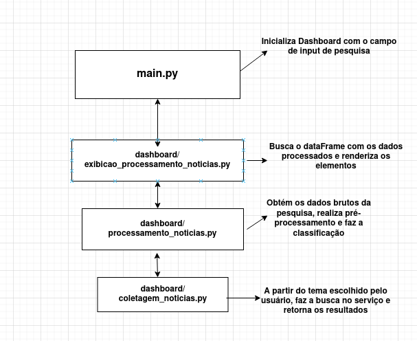

# Classificação sentimental de noticias

## Sobre o projeto
Este projeto realiza a **classificação sentimental de notícias** a partir dos títulos. A ideia central é coletar títulos de notícias, pré-processar o texto, calcular frequências de termos relevantes e classificar cada título como **positivo**, **negativo** ou **neutro** utilizando um léxico (Utilizamos SentiLex). Os resultados são apresentados em um **dashboard interativo** construído com **Streamlit**, que inclui tabelas, gráficos e nuvem de palavras.

**Versão do Python utilizada:** 3.10.12

**Bibliotecas utilizadas:**
- requests  
- bs4  
- pandas  
- streamlit  
- matplotlib  
- nltk  
- wordcloud  
- plotly  
- seaborn

---

## Como executar o projeto
```
- Requisitos -> Ter python >= 3.10.12 e git em sua máquina

- Navegue até seu repositório de sua escolha

- Use -> git clone https://github.com/luisfl04/case_classificacao_noticias.git para clonagem via https

- Entre no repositório do projeto -> cd case_classificacao_noticias 

- Crie um ambiente virtual -> python -m venv amb_virt

- Instale as dependências -> pip install -r requirements.txt

- Execute a aplicação -> streamlit run main.py

- Visualize o dashboard em seu navegador

```

## Como as noticias são classificadas?
A partir da busca feita no serviço RSS do google, a aplicação salva informações como: titulo, data de publicação, fonte e link das noticias. Após obter esses dados, os mesmos são pré-processados com remoção de caracteres especiais e formatação de texto. Com os dados limpos, é feita a busca de cada palavra no léxico armazenado no repositório('/lexico/sentiLex-flex-pt03.txt'), esse léxico possúi palavras já classificadas quanto a polaridade. Com isso, é feita a soma obtida das comparações de cada titulo em relação ao léxico e de acordo com o resultado final a noticia é classificada(positiva, negativa, neutra).

### Abaixo segue um esboço de como os módulos estão estruturados:


## Observações Finais:
O dashboard resultante atende aos requisitivos de uma análise e classificação de dados básica, é importante frisar que pode haver resultados inconsitêntes devido a classificação não observar contextos externos e outros tipos de variações. Portanto, muito possivelmente é necessário uma implementação mais robusta em relação a classificação dessas noticias.
